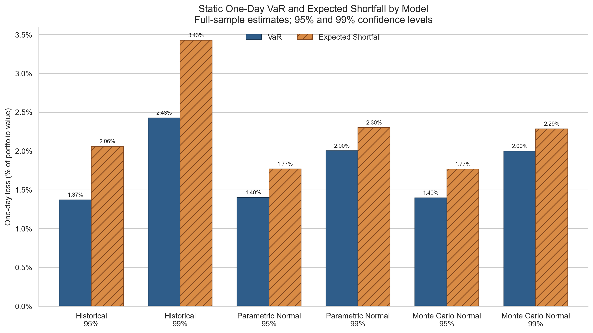
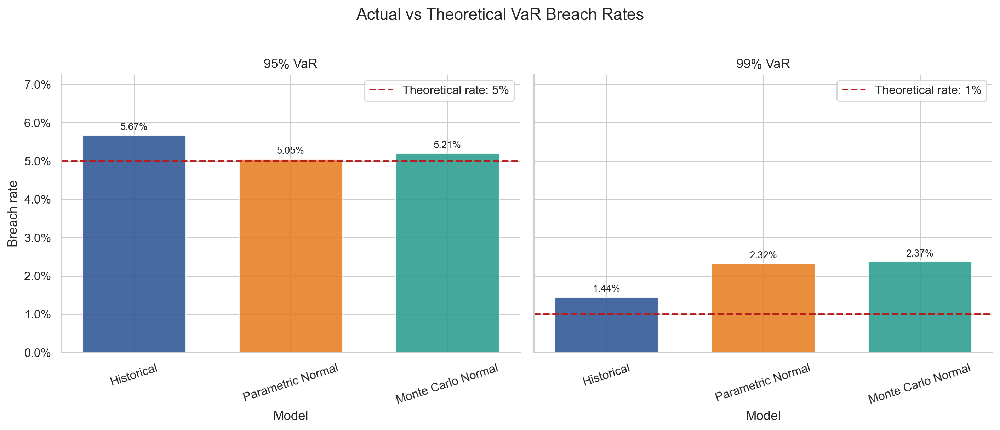
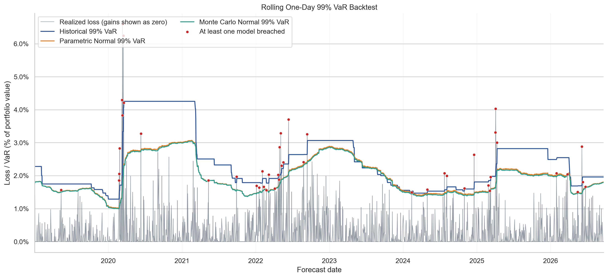
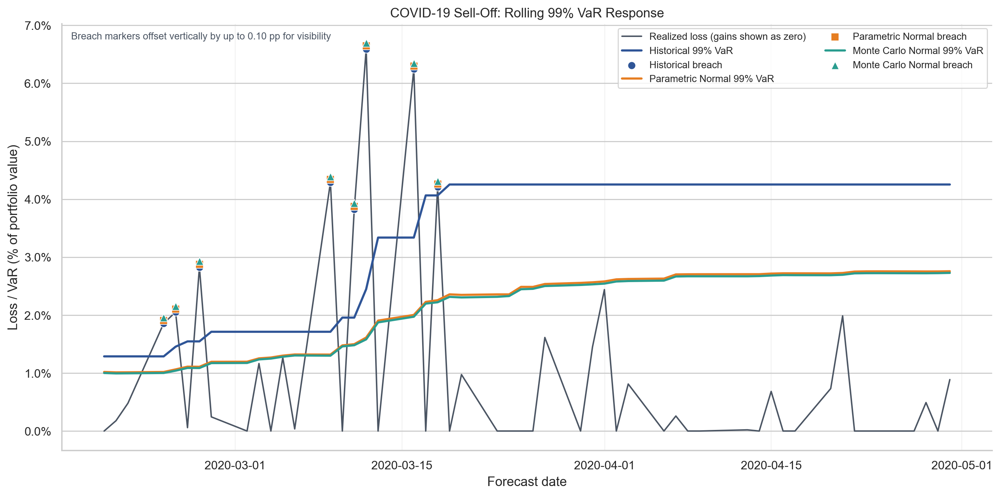

# Market Risk VaR Backtesting & Expected Shortfall Analysis

This project compares Historical, Parametric Normal, and Monte Carlo Normal
VaR and ES for a fixed portfolio of U.S. equities, long-duration Treasuries,
and gold. I evaluated 1,940 one-day-ahead VaR forecasts at 95% and 99% using a
250-day rolling window. VaR is formally backtested with Kupiec and
Christoffersen tests; ES is reported as a companion measure of tail severity.

## Key findings

| Result | What it showed |
|---|---|
| 95% VaR | Breach rates were 5.05%–5.67%, broadly close to the expected 5% for all three models. |
| 99% Normal VaR | Parametric Normal and Monte Carlo Normal breached on 2.32% and 2.37% of days—more than twice the expected rate—and failed the Kupiec and conditional-coverage tests. |
| 99% Historical VaR | Its 1.44% breach rate was closer to the 1% target, but the independence test rejected because breaches clustered. |
| Monte Carlo | Simulation did not produce a better tail model by itself: results stayed close to Parametric Normal because both used the same Normal assumption. |

## Portfolio and data

| ETF | Exposure | Weight |
|---|---|---:|
| SPY | U.S. large-cap equities | 40% |
| QQQ | U.S. technology-heavy equities | 25% |
| TLT | Long-duration U.S. Treasuries | 20% |
| GLD | Gold | 15% |

The portfolio is treated as rebalanced to these fixed weights each day. This
keeps the comparison focused on the risk models rather than changes in asset
allocation.

Daily prices come from Yahoo Finance through `yfinance` with
`auto_adjust=True`. The valid price sample runs from `2018-01-02` to
`2026-09-21`, producing 2,190 aligned return observations. The saved raw file
also contains a trailing `2026-09-22` row with no valid prices, which is
excluded before returns are calculated. More detail is in
[`docs/data_notes.md`](docs/data_notes.md).

## Models and backtest design

- **Historical VaR and ES** use the observed loss distribution. The method can
  reflect fat tails already present in the window, but the 99% estimate from
  250 days depends on only about 2–3 tail observations.
- **Parametric Normal VaR and ES** use the rolling sample mean and standard
  deviation under a Normal return assumption. This gives a simple benchmark
  that responds to changing volatility but keeps symmetric, thin tails.
- **Monte Carlo Normal VaR and ES** simulate correlated returns for the four
  ETFs using the rolling mean vector and covariance matrix. The rolling model
  uses 20,000 paths per date and a fixed random seed. Because the simulated
  returns are Normal, I expect its results to be close to Parametric Normal.

Loss is defined as the negative of portfolio return, so VaR and ES are reported
as positive loss amounts. A breach occurs only when realized loss is strictly
greater than VaR.

For each forecast date, all three models use the preceding 250 trading days and
not the current day's return. The first forecast is `2019-01-02`, the last is
`2026-09-21`, and the backtest contains 1,940 one-day-ahead forecasts. I use the
Kupiec unconditional-coverage test for breach frequency, the Christoffersen
independence test for clustering, and the Christoffersen conditional-coverage
test for both properties together.

## Main results

Full-sample estimates show how assumptions affect tail size. Historical 99%
VaR and ES were 2.427% and 3.427%, versus 2.003% and 2.303% for Parametric
Normal and 1.998% and 2.287% for Monte Carlo Normal. The larger Historical tail
is consistent with 8.71 excess kurtosis; at 95%, however, both Normal VaRs were
slightly higher.



The rolling results are the main part of the project:

| Model | Confidence | Expected breaches | Actual breaches | Actual rate | Kupiec | Independence | Conditional coverage |
|---|---:|---:|---:|---:|---|---|---|
| Historical | 95% | 97.0 | 110 | 5.67% | Do not reject (0.184) | Do not reject (0.472) | Do not reject (0.320) |
| Historical | 99% | 19.4 | 28 | 1.44% | Do not reject (0.066) | Reject (0.007) | Reject (0.005) |
| Parametric Normal | 95% | 97.0 | 98 | 5.05% | Do not reject (0.917) | Do not reject (0.630) | Do not reject (0.886) |
| Parametric Normal | 99% | 19.4 | 45 | 2.32% | Reject (<0.001) | Do not reject (0.107) | Reject (<0.001) |
| Monte Carlo Normal | 95% | 97.0 | 101 | 5.21% | Do not reject (0.679) | Do not reject (0.739) | Do not reject (0.868) |
| Monte Carlo Normal | 99% | 19.4 | 46 | 2.37% | Reject (<0.001) | Do not reject (0.120) | Reject (<0.001) |

At 95%, no test rejected any model; non-rejection does not prove correctness.
At 99%, the Normal models failed Kupiec and conditional coverage. Historical
passed Kupiec but failed independence and conditional coverage, so its closer
breach count still hid clustering.



The rolling 99% paths also show the difference in how the models update.
Historical VaR moves in steps as observations enter and leave the window. The
Normal estimates move more smoothly and remain close to one another.



## Stress-period analysis

The COVID-19 sell-off (`2020-02-19` to `2020-04-30`) and 2022 tightening period
are ex-post descriptive labels; they were not used in model fitting. Historical
VaR recorded 14 COVID-period breaches at 95% and 8 at 99%. Parametric Normal
and Monte Carlo Normal each recorded 12 breaches at 95% and 8 at 99%.

The worst loss in the backtest was **6.59% on 2020-03-12**. All three 99% VaR
forecasts were breached that day: Historical was 2.45%, Parametric Normal was
1.61%, and Monte Carlo Normal was 1.58%. As a simple descriptive response
marker—not an industry standard—I used 1.5 times the pre-COVID median 99% VaR.
Historical reached the marker on
`2020-03-10`; both Normal models reached it on `2020-03-12`. Historical reacted
earlier by this rule, but it still experienced eight 99% breaches during the
period.



During the 2022 tightening period, 95% breach counts were 31 for Historical, 31
for Parametric Normal, and 32 for Monte Carlo Normal. At 99%, the counts were 9,
16, and 16.

## What I learned

Monte Carlo is not automatically a better tail model. I initially
expected the simulation results to differ more from Parametric Normal. They did
not, because both approaches used the same Normal distribution and the same
underlying covariance information. Simulation changes how returns are
generated; it does not create fat tails by itself.

The confidence level also changes the conclusion. The models looked much
more comfortable at 95% than at 99%. A 250-day window contains little evidence
about a 1% tail, especially for the Historical model, so a result that looks
reasonable at one confidence level should not be assumed to work at another.

## Limitations

- The portfolio uses fixed, linear ETF weights and excludes transaction costs,
  liquidity effects, and nonlinear positions.
- The 250-day window is a modeling choice; shorter or longer windows would
  change responsiveness and sampling error.
- Historical 99% VaR is based on very few tail observations in each window.
- Parametric Normal and Monte Carlo Normal both impose symmetric, thin-tailed
  returns.
- The asymptotic backtest p-values should be interpreted cautiously when 99%
  breaches are sparse.
- The project calculates ES but does not include a formal ES backtest.
- Results depend on the selected Yahoo Finance sample and may change with a
  different period or later data revisions.

## Repository structure

```text
market-risk-var-es-backtesting-python/
├── data/
│   ├── raw/
│   │   └── README.md
│   └── processed/
│       ├── asset_returns.csv
│       └── portfolio_returns.csv
├── docs/
│   ├── data_notes.md
│   └── project_notes.md
├── notebooks/
│   ├── 01_data_and_portfolio_setup.ipynb
│   ├── 02_var_es_models.ipynb
│   └── 03_var_backtesting.ipynb
├── outputs/
│   ├── figures/
│   └── tables/
├── src/
│   └── download_data.py
├── .gitignore
├── README.md
└── requirements.txt
```

## How to run

From the project root:

```bash
python3 -m venv .venv
source .venv/bin/activate
python3 -m pip install --upgrade pip
python3 -m pip install -r requirements.txt
python3 src/download_data.py
python3 -m jupyter nbconvert --execute --to notebook --inplace notebooks/01_data_and_portfolio_setup.ipynb
python3 -m jupyter nbconvert --execute --to notebook --inplace notebooks/02_var_es_models.ipynb
python3 -m jupyter nbconvert --execute --to notebook --inplace notebooks/03_var_backtesting.ipynb
```

Run the notebooks in numerical order. Downloading data again may produce a
different sample, so it should not be expected to reproduce the committed
snapshot exactly. Notes on the main choices and possible extensions are in
[`docs/project_notes.md`](docs/project_notes.md).
